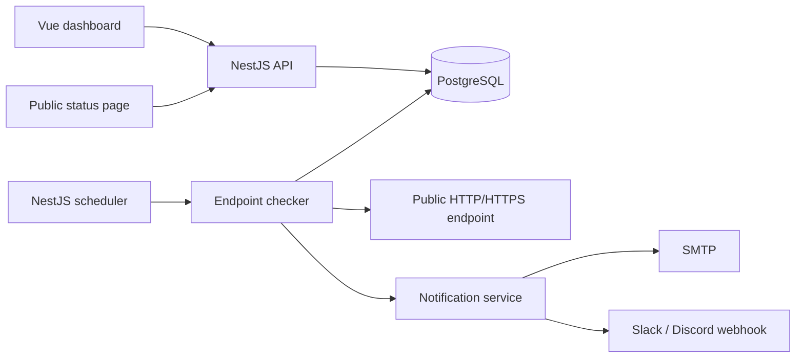
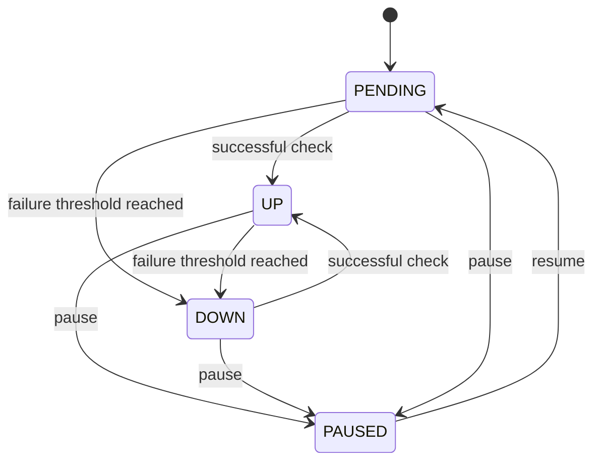

# PulseWatch Architecture

## Runtime

The application is intentionally a modular monolith for v1. That keeps local development, deployment, debugging and the portfolio story understandable while still separating authentication, monitoring, incidents, dashboards and notifications into NestJS modules.

## Monitor state machine

Each failed check increments `consecutiveFailures`. An incident is opened only after the configured threshold is reached. A successful check resets the failure counter and resolves any active incident immediately.

## Check execution

1. Validate the configured URL.
2. Resolve the hostname and reject blocked IP ranges.
3. Perform a GET or HEAD request with a timeout.
4. Handle redirects manually, re-validating every redirect target.
5. Persist a `CheckResult`.
6. Update the monitor state and last response metadata.
7. Open or resolve an incident when the state transition requires it.
8. Deliver DOWN/recovery notifications asynchronously.

## Scheduler

A NestJS interval wakes every 30 seconds and selects monitors that are due based on `lastCheckedAt` and `intervalSec`. Paused monitors are ignored. Due checks run in configurable batches (`CHECK_WORKER_BATCH_SIZE`).

For larger deployments this scheduling/checking layer is the natural place to replace in-process work with Redis/BullMQ workers and distributed locking.

## Public status pages

Public status pages are opt-in per monitor. Enabling one generates a random slug stored on the monitor. The unauthenticated endpoint exposes only a read-only monitoring view: service name/URL, current status, 24h uptime/latency, recent checks and incident history. Account/user data is never included.

## Notifications

Notification channel destinations are user-scoped. API list responses mask destinations. Email delivery uses SMTP configuration from environment variables. Webhooks are required to use HTTPS and pass the same public-network URL safety checks before delivery.

## Security boundary

User-provided monitor URLs are untrusted. PulseWatch:

- allows only HTTP and HTTPS;
- rejects credentials embedded in URLs;
- rejects localhost;
- rejects private, loopback, link-local and common reserved IP ranges;
- resolves DNS before requests;
- manually validates redirect targets;
- limits redirects;
- applies request timeouts;
- allows only GET and HEAD monitor methods.

Application-level SSRF checks are useful but are not a complete network sandbox. A production SaaS should also apply infrastructure-level outbound firewall/egress controls, DNS-rebinding defenses, request rate limits and abuse controls.

## Persistence

PostgreSQL stores users, monitors, check results, incidents and notification channels. Prisma migrations are applied during setup and production container startup. Docker volumes keep database data across container restarts.
